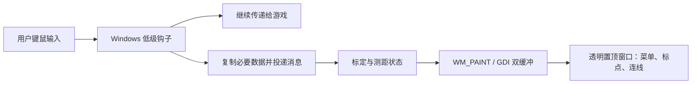

# 原项目覆盖层分析与第一版实现

## 1. 原项目是怎样把菜单画在游戏上方的？

源码基于本地 `refer_repo/PUBG_MAP`。

| 环节 | 原源码位置 | 作用 |
|---|---|---|
| 创建覆盖窗口 | `PUBG_mortar/MainWindow.cpp:105`，`CreateMyWindow` | `WS_POPUP` 创建无边框窗口；`WS_EX_LAYERED` 和 `WS_EX_TRANSPARENT` 用于分层窗口与鼠标穿透 |
| 桌面合成与置顶 | `PUBG_mortar/main.cpp:41` | 设置分层属性、`DwmExtendFrameIntoClientArea` 扩展框架，并用 `HWND_TOPMOST` 置顶 |
| 绘图入口 | `PUBG_mortar/MainWindow.cpp:328`，`WM_PAINT` | 在内存 DC 绘制，再通过 `BitBlt` 拷贝到窗口，减少闪烁 |
| 菜单和点 | `PUBG_mortar/MainWindow.cpp:445`，`Draw` | GDI 画背景矩形、文本、圆形标记；菜单是绘制的文字，并非可点击控件 |
| 输入监听 | `PUBG_mortar/HookHandler.cpp:98`，`installHook` | `WH_MOUSE_LL` 和 `WH_KEYBOARD_LL` 获取全局输入 |
| 输入传递 | `PUBG_mortar/HookHandler.cpp:95` | `CallNextHookEx` 保留原始输入链 |
| 设置窗口 | `PUBG_mortar/Setting.h`、`Setting.cpp` | MFC `CDialogEx`，编辑快捷键、各档 100 米像素数、菜单位置等 |

核心结构如下：



这是一块独立的桌面窗口，位于游戏窗口上方，不需要在游戏渲染代码中插入绘图逻辑。因此应优先使用无边框窗口模式。置顶属性本身不意味着能覆盖任何独占全屏画面。

需要区分三个概念：背景透明、鼠标穿透、不会抢焦点。它们分别解决“能看到游戏”“能点到游戏”“键盘仍由游戏接收”，不能只设置一个透明属性就认为全部满足。

## 2. 为什么没有直接复制原项目？

保留其 C++ / Win32 / GDI / 键鼠钩子的主体路线，但原实现存在需要修正的工程问题：

- `GteWindow()` 每次调用都向 `pointList` 添加两个点，即使实例已经创建；输入触发重绘时也会调用，导致持续增长。
- `main.cpp` 使用无等待的 `PeekMessage` 双循环，空闲时仍会占用 CPU。
- 绘图中删除仍被 DC 选中的位图/画刷，没有先恢复旧对象，可能造成资源泄漏。
- `WM_COMMAND` 分支后缺少 `break`，可能落入绘图分支。
- 输入分发共用 `LPARAM` 并强制解释成鼠标结构，事件类型和数据类型关联不明确。
- 只处理 `WM_KEYDOWN/UP`，对 Alt 组合所涉及的 `WM_SYSKEYDOWN/UP` 处理不足。
- 使用桌面范围代替目标游戏客户区，双屏和 DPI 坐标处理不足。
- 通过 M 和滚轮累计状态，没有可靠验证游戏是否接受输入；视图变化后旧点依然参与计算。
- 二进制配置直接信任读取到的集合长度，损坏配置可能导致异常分配或索引。

本机 VS 2022 安装中检测到 MSVC，但未发现 MFC 头文件。覆盖层原本就使用 Win32 API，因此本版把设置也改为 Win32 资源对话框，其余主体技术路线保持一致。

## 3. 本版的透明与输入方案

窗口扩展样式：

```cpp
WS_EX_LAYERED | WS_EX_TRANSPARENT | WS_EX_TOPMOST |
WS_EX_NOACTIVATE | WS_EX_TOOLWINDOW
```

- `WS_EX_LAYERED`：支持分层窗口透明。
- `WS_EX_TRANSPARENT`：结合分层窗口，让输入穿过覆盖层。
- `WS_EX_TOPMOST`：放在普通游戏窗口之上。
- `WS_EX_NOACTIVATE`、`SWP_NOACTIVATE`、`MA_NOACTIVATE`：显示/更新覆盖层不抢焦点。
- `WS_EX_TOOLWINDOW`：避免覆盖层占用普通任务栏/Alt-Tab 入口。
- `WM_NCHITTEST` 返回 `HTTRANSPARENT`，补充透明命中处理。

与原项目依赖 DWM 框架扩展的做法不同，本版显式用 `SetLayeredWindowAttributes(..., LWA_COLORKEY)` 把背景键色透明化。菜单不再填充矩形底色，只绘制文字和文字周围一像素黑色描边，减少对游戏视野的遮挡。标点和连线仍为实色。

`WM_PAINT` 使用完整客户区内存位图做双缓冲。绘制后恢复旧 GDI 对象，再释放创建的对象。消息循环用阻塞的 `GetMessage`；100ms 定时器同步目标窗口位置与前台状态、控制覆盖菜单显隐并更新主窗口状态。

菜单使用可配置的 `FontSize`、`DistanceSize`、`LineGap`、`PanelWidth`。绘图前通过 `DrawText(DT_CALCRECT | DT_WORDBREAK)` 测量每行实际高度，再紧凑排列，避免固定行高造成空白或修改字号后重叠。地图关闭后的短暂显示只保留距离与状态，进一步缩小占用。

`src/OverlayVisibility.h` 独立管理可见性：启动默认隐藏，地图打开时持续显示，从打开变为关闭时记录 `GetTickCount64`；满 3000ms 后隐藏。定时器每 100ms 检查一次，所以实际消失可能晚于阈值不足一个轮询周期。焦点变化不重置倒计时，隐藏不修改测量数据，地图重新打开会取消旧计时。

启动界面为无所有者的 Win32 非模态资源对话框 `IDD_HOME`。首次启动自动显示；关闭只调用 `ShowWindow(SW_HIDE)`，不发送退出消息。托盘双击、托盘“打开主窗口”和再次启动 EXE 都能重新显示同一窗口。主窗口按钮打开有所有者的设置/地图选择对话框；主消息循环用 `IsDialogMessage` 支持 Tab 等键盘导航。真正退出由“退出程序”或托盘“退出”触发。

钩子回调只复制感兴趣的事件并 `PostMessage`，不在钩子中绘图、访问文件或计算复杂内容。事件携带源窗口和当时鼠标位置；消费时再次检查前台窗口和客户区几何。通过 `CallNextHookEx` 保留原按键行为，并忽略带注入标记的输入。这里没有模拟点击或移动鼠标。

前台窗口变化还通过 `SetWinEventHook(EVENT_SYSTEM_FOREGROUND)` 处理，切走时清除屏幕点并隐藏覆盖层，保留地图开关、档位、比例尺和上次结果。当前不实现地图画面识别，M 只是开关状态的推断，F8 是手动校正入口。

## 4. 测距状态和坐标

纯计算逻辑位于 `src/Measurement.h`：

```text
未标定 → F6 → 标定起点 → 标定终点 → 测距起点 → 测距终点 → 显示结果
                                     ↑                         │
                                     └──────下一次取点──────────┘
```

设标定长度为 L 米、屏幕像素距离为 p，则 `metersPerPixel = L / p`。

两点距离为 `hypot(dx, dy) * metersPerPixel`。只处理水平距离，没有高度和弹道假设。

全局鼠标点减去目标客户区左上角的屏幕坐标，转换成客户区坐标。进程启用 PerMonitorV2 DPI awareness，覆盖窗口跟随游戏客户区；不使用固定的主屏尺寸或固定地图尺寸。跨屏幕的负桌面坐标不会直接作为绘图坐标使用。

`src/MapSession.h` 在纯测距逻辑之外维护本局地图状态：`zoom` 为 0–4，`profiles` 保存每个地图/分辨率/DPI 的五个独立比例尺，`lastDistance` 保存最后一次完成的结果。关闭地图或视图变化会清除屏幕点，但不会重新用新的比例尺计算历史距离。

鼠标钩子把带符号的 wheel delta 传给会话状态。仅地图打开时累计，每 120 为一档，上下限分别固定 4 和 0；边界外的多余滚动不形成后续“欠账”。切档载入已存比例尺，没有值则禁止新测量并提示 F6。F10 只重置软件档位；F5 选择地图后开始新局、复位档位、清空历史结果。

比例尺按 `[Scale.<MapId>.<Width>x<Height>.<Dpi>]` 的 `Zoom0`–`Zoom4` 存入 INI，使用 12 位小数；标定完成后立即保存该档。缺失、非数值、非有限数和非正比例尺被忽略，不影响同配置下其他有效档位。原有全局设置段继续兼容。

F7 只设取点区域，不改变地图比例尺。地图有效区域以客户区坐标保存，只在分辨率和 DPI 匹配时恢复。分辨率/DPI 改变时切换对应的比例尺配置；移动窗口不删除历史配置。显示文字明确区分当前结果与上次结果。

## 5. 下一步扩展位置

1. 热键设置：将固定 F5–F10 改为可配置绑定。
2. 网格识别：截图提取网格周期，为状态模块提供已验证的比例尺；保留手动标定回退。
3. 自动地图开关：画面识别确认状态，替代纯按键推断。
4. 跨视图测量：地图配准后将屏幕点转换成统一地图坐标。
5. 高度修正：独立的数据与验证模块，不改变水平测距模块的含义。

本版优先完成可编译、可演示、可现场标定的覆盖测距流程。演示网格验证和 Windows 冒烟检查不能证明 PUBG 中的输入与显示兼容性，仍需要在用户实际显示配置下验证。
